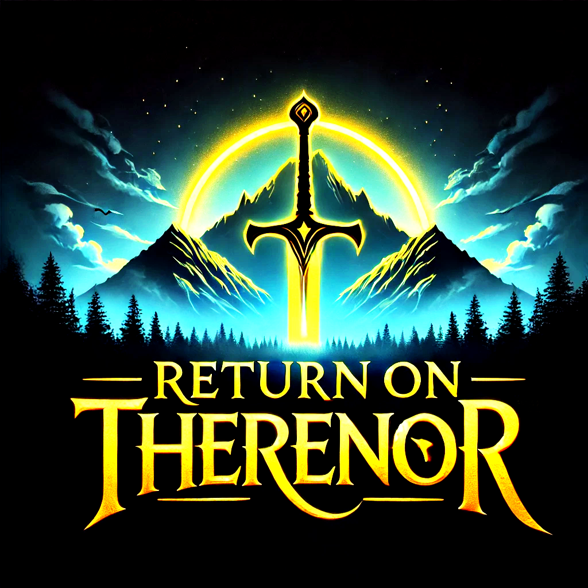

# Return on Therenor

Un jeu en 3 dimensions crée par Tyméo Bonvicini-Renaud, Alexandrine Charette, Rémy Martinot, Noé Mora et Etienne Pacault pour <a href="https://www.trophees-nsi.fr" target="_blank">les trophées NSI 2025</a>

# 1- Résumé
Après avoir triomphé de Zmeyevick, le protagoniste de <b>The legend of Therenor</b> a pris une retraite bien méritée.
Mais un être mal intentionné souhaite dominer le monde et est prêt à sacrifier le héros désormais bien faible pour ressusciter l'hydre.
Le descendant du légendaire héros va devoir prendre la route pour retourner sur l'île de ses ancêtres et sauver son grand-père.

# 2- Jouabilité
<h2>Commandes :</h2>
Le jeu peut se jouer à l'aide du clavier ou d'une manette.
Vous avez la possibilité de changer les touches utilisées pour différentes actions !
En mode clavier, utilisez la souris pour tourner.

# 3- Bibliothèques et logiciels utilisés (et remerciements ;-))
<h2>Panda3D</h2>
Le moteur de jeu utilisé dans ce jeu est Panda 3D, moteur de jeu conçu par l'université Carnegie-Mellon University de Pitsburgh en Pennsylvanie et par Disney Online.
Un grand merci à eux ! <a href="https://www.panda3d.org" target="_blank">Lien vers le site de Panda3D</a>
Ah oui, voici la license de Panda3D :

<b>Copyright © 2008, Carnegie Mellon University. All rights reserved.

Redistribution and use in source and binary forms, with or without modification, are permitted provided that the following conditions are met:

1. Redistributions of source code must retain the above copyright notice, this list of conditions and the following disclaimer.
2. Redistributions in binary form must reproduce the above copyright notice, this list of conditions and the following disclaimer in the documentation and/or other materials provided with the distribution.
3. Neither the name of Carnegie Mellon University nor the names of other contributors may be used to endorse or promote products derived from this software without specific prior written permission.

THIS SOFTWARE IS PROVIDED BY THE AUTHORS “AS IS” AND ANY EXPRESS OR IMPLIED WARRANTIES, INCLUDING, BUT NOT LIMITED TO, THE IMPLIED WARRANTIES OF MERCHANTABILITY AND FITNESS FOR A PARTICULAR PURPOSE ARE DISCLAIMED. IN NO EVENT SHALL THE AUTHORS BE LIABLE FOR ANY DIRECT, INDIRECT, INCIDENTAL, SPECIAL, EXEMPLARY, OR CONSEQUENTIAL DAMAGES (INCLUDING, BUT NOT LIMITED TO, PROCUREMENT OF SUBSTITUTE GOODS OR SERVICES; LOSS OF USE, DATA, OR PROFITS; OR BUSINESS INTERRUPTION) HOWEVER CAUSED AND ON ANY THEORY OF LIABILITY, WHETHER IN CONTRACT, STRICT LIABILITY, OR TORT (INCLUDING NEGLIGENCE OR OTHERWISE) ARISING IN ANY WAY OUT OF THE USE OF THIS SOFTWARE, EVEN IF ADVISED OF THE POSSIBILITY OF SUCH DAMAGE.</b>
<h2>Blender</h2>
C'est grâce au logiciel blender et à sa gratuité que nous avons pu créer de magnifiques environements en 3D pour notre jeu.
Plus d'informations sur <a href="https://www.blender.org" target="_blank">blender.org</a>.
<h2>Sweet Home 3D</h2>
De plus, ce jeu a été partiellement conçu avec Sweet Home 3D :
<b>Projet conçu avec Sweet Home  3D. Contient des modèles 3D et des textures distribués sous licence libre.</b>
Plus d'informations sur <a href="https://www.sweethome3d.com" target="_blank">https://www.sweethome3d.com</a>
